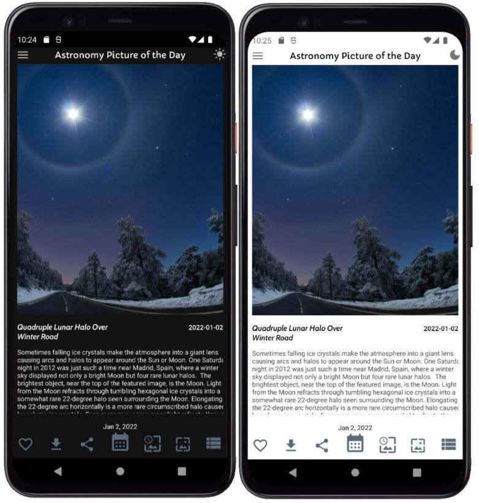

# Astronomy Picture of the Day
https://apod.nasa.gov/apod/astropix.html

## NASA APIs ##
This app generates requests based on NASA's APOD service:
https://api.nasa.gov/

### *Sign up for your API key at:* ###
https://api.nasa.gov/index.html#apply-for-an-api-key

### *An example query:* ###
- Default request: https://api.nasa.gov/planetary/apod?api_key=DEMO_KEY

- For any given date: https://api.nasa.gov/planetary/apod?api_key=DEMO_KEY&date=YYYY-MM-DD

## Download ##
Download it [here](https://raw.githubusercontent.com/PrasoonDhaneshwar/Astronomy-Photo-Of-The-Day-Android/main/Astronomy-Picture-of-the-Day-v1.0.apk) to run the application in your Android phone.

#### App Features: ####
- Select any date and fetch it's corresponding image/video information.
- Fetch high quality images from the APOD Service
- Change your wallpaper daily with "Wallpaper Scheduler".
- "Add" into your "Favorites" and configure the scheduler.
- Dowload high quality and detailed view of picture.
- Support for bigger and landscape orientations

## Screenshots ##

## Dependencies ##

- *[Retrofit](https://square.github.io/retrofit/).* A type-safe HTTP client for Android and Java.
- *[Glide](https://github.com/bumptech/glide).* Fast and efficient open source media management and image loading framework for Android that wraps media decoding, memory and disk caching, and resource pooling into a simple and easy to use interface.
- *[Gson](https://github.com/google/gson).* Convert Java Objects into their JSON representation.
- *[Secrets Gradle Plugin for Android](https://github.com/google/secrets-gradle-plugin).* Plugin for providing your secrets securely to your Android project.
- *[PhotoView](https://github.com/Baseflow/PhotoView).* Easy usable implementation of a zooming Android ImageView.
- This app follows MVVM architecture. and uses Jetpack Components such as Room, Navigation Components with Kotlin Coroutines.